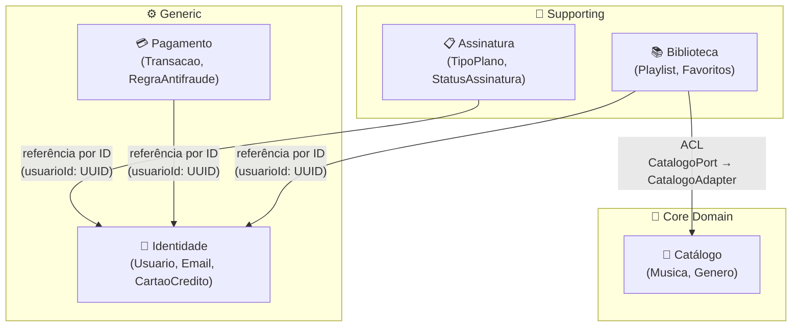
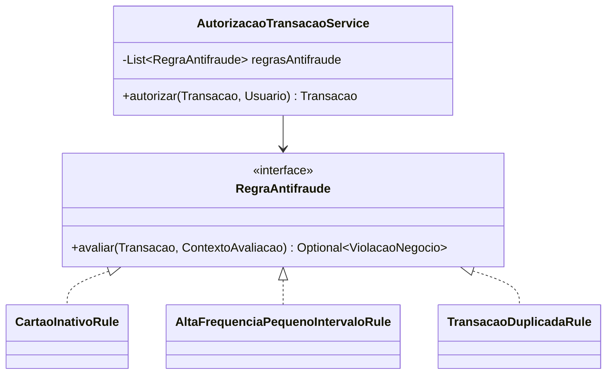
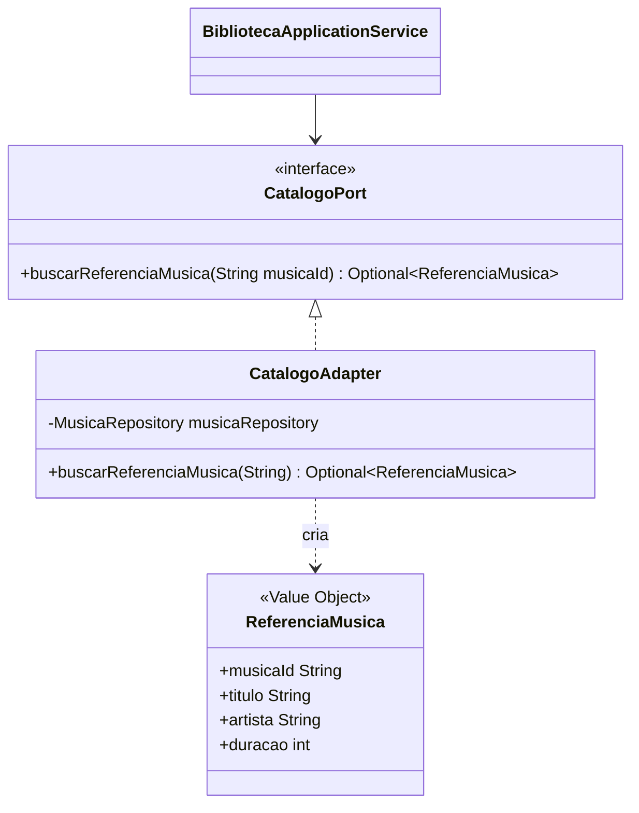
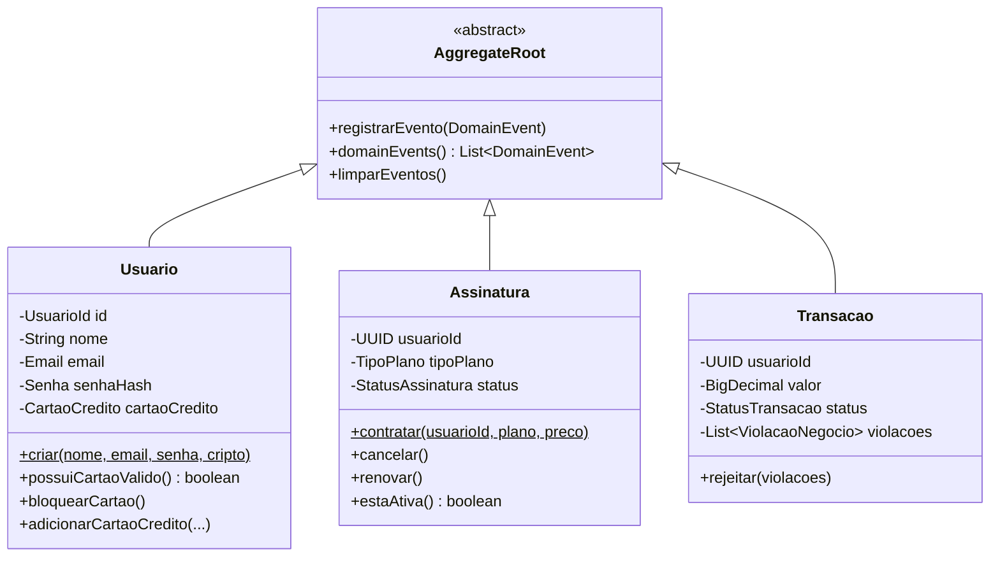

# StramingSong


Plataforma de streaming musical construída com **Domain-Driven Design** completo — design estratégico (5 Bounded Contexts, Context Map, Anti-Corruption Layer) e tático (Aggregates, Value Objects, Domain Services, Repository Pattern) sobre Spring Boot 3.4.5 e Java 21.

---

## Context Map

O mapa abaixo representa os 5 contextos delimitados, seus tipos de subdomínio e as relações entre eles.



> **Diagrama interativo:** [Ver no Miro](https://miro.com/app/board/uXjVHCiIVJ4=/)

### Relações entre contextos

| De | Para | Padrão | Implementação |
|---|---|---|---|
| Biblioteca | Catálogo | **ACL** (Anti-Corruption Layer) | `CatalogoPort` (interface) + `CatalogoAdapter` (impl) |
| Assinatura | Identidade | Referência por ID | `UUID usuarioId` — sem acoplamento de modelo |
| Pagamento | Identidade | Referência por ID | `UUID usuarioId` — sem acoplamento de modelo |
| Biblioteca | Identidade | Referência por ID | `UUID usuarioId` — sem acoplamento de modelo |

---

## Bounded Contexts

| Contexto | Tipo | Pacote | Aggregate Roots | Responsabilidade |
|---|---|---|---|---|
| **Catálogo** | Core Domain | `catalogo` | `Musica` | Gerenciar o catálogo de músicas disponíveis |
| **Biblioteca** | Supporting | `biblioteca` | `Playlist`, `Favoritos` | Playlists e músicas favoritadas por usuário |
| **Assinatura** | Supporting | `assinatura` | `Assinatura` | Contratos de plano (BASIC / PREMIUM) |
| **Identidade** | Generic | `identidade` | `Usuario` | Cadastro, autenticação e cartão de crédito |
| **Pagamento** | Generic | `pagamento` | `Transacao` | Autorização de transações com regras antifraude |

---

## Design Patterns

### Strategy — Regras Antifraude

`RegraAntifraude` é uma interface Strategy: novas regras são adicionadas implementando-a sem modificar o código existente (**OCP**).



### Factory Method — Value Objects e Aggregates

Todos os Value Objects e Aggregates usam factories estáticos que encapsulam a validação:

| Factory | Valida |
|---|---|
| `Email.de(String)` | Regex de formato + normalização lowercase |
| `Senha.deTextoSimples(String, CriptografadorSenha)` | Tamanho mínimo + hash BCrypt |
| `CartaoCredito.de(String, String, YearMonth)` | 4 últimos dígitos + validade futura |
| `Usuario.criar(nome, email, senha, criptografador)` | Compõe todos acima |
| `Assinatura.contratar(usuarioId, TipoPlano, BigDecimal)` | Status inicial ATIVA |
| `MusicaId.novo()` / `PlaylistId.novo()` | UUID aleatório encapsulado |

### Anti-Corruption Layer — Biblioteca → Catálogo



`ReferenciaMusica` é uma cópia local dos dados do Catálogo. A Biblioteca nunca depende de `Musica` diretamente — se o modelo do Catálogo mudar, apenas `CatalogoAdapter` precisa ser atualizado.

---

## Modelo de Domínio

### Aggregates e Value Objects



### Value Objects (imutáveis, igualdade por valor)

| Value Object | Contexto | Validação |
|---|---|---|
| `Email` | Identidade | Regex RFC-like + lowercase |
| `Senha` | Identidade | Tamanho mínimo + BCrypt |
| `CartaoCredito` | Identidade | 4 dígitos + validade futura |
| `UsuarioId` | Identidade | UUID v4 |
| `MusicaId` | Catálogo | UUID v4 |
| `PlaylistId` | Biblioteca | UUID v4 |
| `ReferenciaMusica` | Biblioteca | Snapshot do Catálogo via ACL |
| `ViolacaoNegocio` | Pagamento | Código + mensagem descritiva |

---

## API REST

### Endpoints (20 total)

| Método | Rota | Contexto | Descrição |
|---|---|---|---|
| `POST` | `/api/usuarios` | Identidade | Cadastrar usuário |
| `GET` | `/api/usuarios/{id}` | Identidade | Buscar usuário por ID |
| `POST` | `/api/usuarios/{id}/cartao` | Identidade | Adicionar cartão de crédito |
| `DELETE` | `/api/usuarios/{id}/cartao` | Identidade | Bloquear cartão |
| `GET` | `/api/musicas` | Catálogo | Listar todas as músicas |
| `POST` | `/api/musicas` | Catálogo | Cadastrar música |
| `GET` | `/api/musicas/{id}` | Catálogo | Buscar música por ID |
| `GET` | `/api/musicas/genero/{genero}` | Catálogo | Listar por gênero |
| `POST` | `/api/playlists` | Biblioteca | Criar playlist |
| `GET` | `/api/playlists/{id}` | Biblioteca | Buscar playlist |
| `POST` | `/api/playlists/{id}/musicas` | Biblioteca | Adicionar música à playlist |
| `DELETE` | `/api/playlists/{id}/musicas/{musicaId}` | Biblioteca | Remover música da playlist |
| `GET` | `/api/favoritos/{usuarioId}` | Biblioteca | Listar favoritos do usuário |
| `POST` | `/api/favoritos/{usuarioId}/musicas` | Biblioteca | Favoritar música |
| `DELETE` | `/api/favoritos/{usuarioId}/musicas/{musicaId}` | Biblioteca | Desfavoritar música |
| `POST` | `/api/assinaturas` | Assinatura | Contratar plano |
| `GET` | `/api/assinaturas/{id}` | Assinatura | Buscar assinatura |
| `PUT` | `/api/assinaturas/{id}/cancelar` | Assinatura | Cancelar assinatura |
| `POST` | `/api/transacoes` | Pagamento | Autorizar transação |
| `GET` | `/api/transacoes/{usuarioId}` | Pagamento | Histórico de transações |

**Documentação interativa:** `http://localhost:8080/swagger-ui.html`

---

## Estrutura do Projeto

```
src/main/java/EstevezAlvarez/StramingSong/
├── shared/
│   ├── domain/
│   │   ├── AggregateRoot.java       ← base com Domain Events
│   │   ├── DomainEvent.java
│   │   ├── DomainException.java
│   │   └── GlobalExceptionHandler.java
│   └── infra/
│       ├── CorsConfig.java
│       └── YearMonthConverter.java
│
├── identidade/                       ← Generic Subdomain
│   ├── api/          UsuarioController
│   ├── application/  UsuarioApplicationService
│   ├── domain/
│   │   ├── model/    Usuario, Email, Senha, CartaoCredito, UsuarioId
│   │   ├── service/  CadastroUsuarioService
│   │   └── repository/ UsuarioRepository (interface)
│   └── infra/        BcryptCriptografadorSenha, UsuarioRepositoryImpl
│
├── catalogo/                         ← Core Domain
│   ├── api/          MusicaController
│   ├── application/  CatalogoApplicationService
│   ├── domain/
│   │   ├── model/    Musica, MusicaId, Genero
│   │   └── repository/ MusicaRepository (interface)
│   └── infra/        MusicaRepositoryImpl
│
├── biblioteca/                       ← Supporting Subdomain
│   ├── acl/          CatalogoPort (interface), CatalogoAdapter (impl)
│   ├── api/          BibliotecaController
│   ├── application/  BibliotecaApplicationService
│   ├── domain/
│   │   ├── model/    Playlist, PlaylistId, Favoritos, ReferenciaMusica
│   │   └── repository/ PlaylistRepository, FavoritosRepository
│   └── infra/        PlaylistRepositoryImpl, FavoritosRepositoryImpl
│
├── assinatura/                       ← Supporting Subdomain
│   ├── api/          AssinaturaController
│   ├── application/  AssinaturaApplicationService
│   ├── domain/
│   │   ├── model/    Assinatura, TipoPlano, StatusAssinatura
│   │   ├── service/  AssinaturaService
│   │   └── repository/ AssinaturaRepository (interface)
│   └── infra/        AssinaturaRepositoryImpl
│
└── pagamento/                        ← Generic Subdomain
    ├── api/          TransacaoController
    ├── application/  AutorizacaoApplicationService
    ├── domain/
    │   ├── model/    Transacao, ViolacaoNegocio, StatusTransacao
    │   ├── rules/    RegraAntifraude (interface), CartaoInativoRule,
    │   │             AltaFrequenciaPequenoIntervaloRule, TransacaoDuplicadaRule
    │   ├── service/  AutorizacaoTransacaoService
    │   └── repository/ TransacaoRepository (interface)
    └── infra/        TransacaoRepositoryImpl
```

---

## Quick Start

### Modo Dev (H2 in-memory)

```bash
./mvnw spring-boot:run
```

- API: `http://localhost:8080`
- Swagger: `http://localhost:8080/swagger-ui.html`
- H2 Console: `http://localhost:8080/h2-console` (JDBC URL: `jdbc:h2:mem:streamingdb`)

### Modo Produção (Docker Compose)

```bash
# Build do JAR
./mvnw package -DskipTests

# Subir PostgreSQL + API + Frontend
docker-compose up --build
```

| Serviço | URL |
|---|---|
| API | `http://localhost:8085` |
| Frontend | `http://localhost:3001` |
| PostgreSQL | `localhost:5435` / db: `streamingdb` / user: `postgres` |

### Variáveis de ambiente (produção)

| Variável | Padrão no Compose | Descrição |
|---|---|---|
| `DB_HOST` | `db` | Host do PostgreSQL |
| `DB_PORT` | `5432` | Porta interna do container |
| `DB_NAME` | `streamingdb` | Nome do banco |
| `DB_USER` | `postgres` | Usuário |
| `DB_PASS` | `postgres` | Senha |

---

## Princípios SOLID aplicados

| Princípio | Onde |
|---|---|
| **SRP** | Cada camada tem uma responsabilidade: Controller (HTTP), ApplicationService (orquestração), DomainService (regras), Repository (persistência) |
| **OCP** | `RegraAntifraude`: novas regras antifraude sem modificar `AutorizacaoTransacaoService` |
| **LSP** | Todos os `*RepositoryImpl` substituem as interfaces de repositório sem surpresas |
| **ISP** | `CatalogoPort` expõe apenas `buscarReferenciaMusica()` — a Biblioteca não conhece a interface completa do Catálogo |
| **DIP** | Application Services dependem apenas de interfaces de repositório e ports, nunca de implementações |

---

## Stack

| Camada | Tecnologia |
|---|---|
| Runtime | Java 21 (eclipse-temurin:21-jre-alpine) |
| Framework | Spring Boot 3.4.5 |
| Persistência | Spring Data JPA + Hibernate |
| Banco (dev) | H2 in-memory |
| Banco (prod) | PostgreSQL 16-alpine |
| Segurança | Spring Security Crypto (BCrypt) |
| Documentação | springdoc-openapi 2.8.8 (Swagger UI) |
| Build | Maven Wrapper 3.9 |
| Boilerplate | Lombok |
| Conteinerização | Docker + Docker Compose |
| CI | GitHub Actions (`.github/workflows/ci.yml`) |
