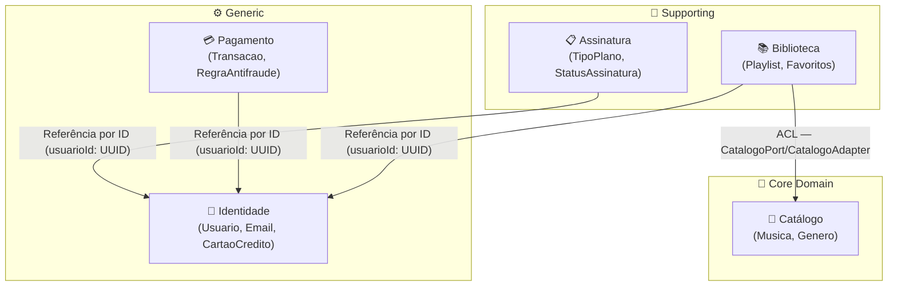

# Respostas às Rubricas de Avaliação — StramingSong

**Projeto:** StramingSong — Plataforma de Streaming Musical  
**Stack:** Java 21 · Spring Boot 3.4.5 · Spring Data JPA · PostgreSQL · Docker  
**Arquitetura:** Domain-Driven Design (DDD) com 5 Bounded Contexts  

---

## Competência 1 — Desenvolver software aplicando Design Patterns

### 1.1 — Importância dos padrões de design na organização e reutilização de soluções

Padrões de design são soluções documentadas e testadas para problemas recorrentes de software. Sua importância está em três dimensões: **comunicação** (oferecem vocabulário compartilhado entre desenvolvedores — dizer "aqui usei Strategy" comunica mais do que descrever a estrutura), **organização** (separam responsabilidades de forma previsível, tornando o código navegável) e **reutilização** (o mesmo padrão resolve a mesma categoria de problema em qualquer contexto).

No StramingSong, os padrões foram aplicados de forma intencional e documentada em três pontos críticos:

**Strategy** — `RegraAntifraude` (interface em `pagamento/domain/rules/`): a avaliação de transações envolve múltiplas regras independentes. Ao invés de um único método com vários `if`s, cada regra é uma implementação da interface. O serviço `AutorizacaoTransacaoService` itera sobre uma lista de `RegraAntifraude` sem conhecer as implementações concretas. Isso permite adicionar novas regras sem tocar no código existente.

**Factory Method** — em todos os Value Objects e Aggregates: `Email.de()`, `Senha.deTextoSimples()`, `CartaoCredito.de()`, `Usuario.criar()`, `Assinatura.contratar()`. Cada factory encapsula validação de invariantes antes de permitir a criação do objeto. Sem esse padrão, a validação ficaria espalhada em vários lugares — ou pior, seria esquecida.

**Repository** — interface em `domain/repository/`, implementação em `infra/`: separa o domínio da tecnologia de persistência. O domínio depende apenas de `UsuarioRepository` (interface) — não sabe se a implementação usa JPA, H2 ou PostgreSQL.

**Anti-Corruption Layer** (padrão estrutural DDD) — `CatalogoPort` + `CatalogoAdapter`: a Biblioteca precisava de dados do Catálogo sem se acoplar ao modelo interno do Catálogo. O adapter traduz o modelo externo para `ReferenciaMusica`, um Value Object local da Biblioteca.

```java
// AutorizacaoTransacaoService — Strategy em ação
List<ViolacaoNegocio> violacoes = regrasAntifraude.stream()
    .map(regra -> regra.avaliar(transacao, contexto))
    .filter(Optional::isPresent)
    .map(Optional::get)
    .toList();
```

---

### 1.2 — Princípios SOLID no contexto do projeto

Os cinco princípios SOLID foram aplicados em todo o projeto, não como objetivo em si, mas como consequência natural das decisões de design:

**SRP — Single Responsibility Principle**  
Cada camada tem exatamente uma razão para mudar. O `UsuarioController` muda se o protocolo HTTP mudar. O `UsuarioApplicationService` muda se o fluxo de negócio mudar. O `CadastroUsuarioService` muda se as regras de criação de usuário mudarem. O `UsuarioRepositoryImpl` muda se a estratégia de persistência mudar. Nenhuma dessas camadas conhece as responsabilidades das outras.

**OCP — Open/Closed Principle**  
`RegraAntifraude` é a demonstração mais explícita. O `AutorizacaoTransacaoService` está **fechado para modificação** — nunca precisa mudar para acomodar uma nova regra. Mas o sistema está **aberto para extensão** — basta implementar a interface e registrar o `@Component` no contexto Spring. As três regras existentes (`CartaoInativoRule`, `AltaFrequenciaPequenoIntervaloRule`, `TransacaoDuplicadaRule`) coexistem sem se conhecer.

**LSP — Liskov Substitution Principle**  
Qualquer `*RepositoryImpl` pode substituir sua interface sem alterar o comportamento esperado pelo código que a usa. O `BibliotecaApplicationService` usa `PlaylistRepository` — se o `PlaylistRepositoryImpl` for trocado por uma implementação em memória (para testes), o comportamento observado é idêntico.

**ISP — Interface Segregation Principle**  
`CatalogoPort` expõe apenas o método que a Biblioteca precisa: `buscarReferenciaMusica(String musicaId)`. A Biblioteca não é forçada a depender de métodos de escrita, listagem ou atualização do Catálogo. A interface é mínima por design.

**DIP — Dependency Inversion Principle**  
Todos os Application Services dependem de abstrações (interfaces), não de implementações concretas. O `BibliotecaApplicationService` recebe `PlaylistRepository` e `CatalogoPort` via injeção — ambas são interfaces. O Spring injeta as implementações concretas em tempo de execução, mas o domínio não sabe disso.

```java
// DIP — ApplicationService depende de interfaces, nunca de implementações
public class BibliotecaApplicationService {
    private final PlaylistRepository playlistRepository;   // interface
    private final CatalogoPort catalogoPort;               // interface (ACL)
    private final FavoritosRepository favoritosRepository; // interface
}
```

---

### 1.3 — Padrões de projeto para estruturar criação de objetos e organizar responsabilidades

O padrão **Factory Method** foi aplicado sistematicamente para dois problemas distintos:

**Problema 1: validação centralizada na criação.** Em Java, construtores públicos não impedem a criação de objetos inválidos — a validação fica dispersa em quem chama o construtor. Os factories resolvem isso:

```java
// Email.de() — nenhum Email inválido pode ser criado
public static Email de(String endereco) {
    Objects.requireNonNull(endereco, "E-mail não pode ser nulo");
    String normalizado = endereco.trim().toLowerCase();
    if (!FORMATO_EMAIL.matcher(normalizado).matches()) {
        throw new DomainException("Formato de e-mail inválido: " + endereco);
    }
    return new Email(normalizado);
}
```

O construtor é `private`. O único caminho de criação é `Email.de()`. Se a validação falhar, o objeto simplesmente não existe — não há objeto `Email` com email inválido no sistema.

**Problema 2: encapsular lógica de inicialização de Aggregates.** `Usuario.criar()` não apenas instancia — define o estado inicial do agregado (ID gerado, senha hasheada, email normalizado):

```java
public static Usuario criar(String nome, String email, String senha, CriptografadorSenha criptografador) {
    validarNome(nome);
    Email emailValido = Email.de(email);
    Senha senhaValida = Senha.deTextoSimples(senha, criptografador);
    return new Usuario(UsuarioId.novo(), nome.trim(), emailValido, senhaValida);
}
```

O mesmo padrão aparece em `Assinatura.contratar()` (define status inicial como ATIVA), `CartaoCredito.de()` (valida dígitos e validade), `MusicaId.novo()` (gera UUID).

Além dos factories, o **Repository Pattern** organiza a responsabilidade de persistência fora do domínio. O domínio declara o contrato (`MusicaRepository` com `buscar`, `salvar`, `listar`) e a infraestrutura implementa com JPA.

---

### 1.4 — Estrutura de código com padrões para facilitar manutenção, evolução e integração

O projeto aplica três decisões estruturais que impactam diretamente manutenção, evolução e integração:

**1. Pacotes por bounded context, não por camada técnica.**  
A estrutura `identidade/`, `catalogo/`, `biblioteca/` etc. permite que toda a lógica de um contexto seja encontrada em um único lugar. Para modificar a lógica de playlists, o desenvolvedor vai em `biblioteca/` e encontra tudo: `api/`, `application/`, `domain/`, `infra/`. Não precisa navegar entre `controllers/`, `services/`, `repositories/` separados.

**2. Repository Pattern com separação interface/implementação.**  
`MusicaRepository` (interface em `catalogo/domain/repository/`) é o contrato que o domínio conhece. `MusicaRepositoryImpl` (em `catalogo/infra/`) é a implementação JPA. O perfil `dev` usa H2 in-memory; `prod` usa PostgreSQL — o domínio não muda. Para trocar de banco, apenas a implementação muda.

**3. ACL como barreira de evolução entre contextos.**  
Quando o modelo de `Musica` no Catálogo muda (novos campos, renomeações), o `CatalogoAdapter` absorve a mudança e converte para `ReferenciaMusica`. A Biblioteca continua usando `ReferenciaMusica` inalterada. Sem o ACL, cada mudança no Catálogo seria uma mudança em cascata pela Biblioteca.

```java
// ReferenciaMusica — cópia local imutável no contexto Biblioteca
// Se Musica mudar no Catálogo, ReferenciaMusica (e a Biblioteca) ficam intactas
@Embeddable
public class ReferenciaMusica {
    private String musicaId;
    private String titulo;
    private String artista;
    private int duracaoSegundos;
}
```

---

### 1.5 — Padrões comportamentais para comunicação e interação entre componentes

O padrão **Strategy** é o padrão comportamental central do projeto. Ele resolve um problema concreto: como avaliar uma transação contra múltiplas regras de negócio independentes sem criar acoplamento entre elas?

A solução: cada regra é uma estratégia intercambiável. O `AutorizacaoTransacaoService` (contexto) recebe as estratégias via injeção e as delega sem conhecê-las:

```java
public interface RegraAntifraude {
    Optional<ViolacaoNegocio> avaliar(Transacao transacao, ContextoAvaliacao contexto);
}
```

As três implementações são completamente independentes:

- `CartaoInativoRule` — verifica se o cartão do usuário está ativo
- `AltaFrequenciaPequenoIntervaloRule` — detecta mais de 3 transações em 2 minutos
- `TransacaoDuplicadaRule` — detecta transações de mesmo valor em intervalo curto

O `AutorizacaoTransacaoService` itera sobre todas, coleta as violações e rejeita a transação se houver alguma. Ele não contém nenhuma lógica de negócio das regras — apenas a orquestração.

A consequência prática: uma quarta regra (por exemplo, `LimiteDiarioExcedidoRule`) é adicionada criando uma nova classe com `@Component` que implementa `RegraAntifraude`. Zero linhas modificadas no código existente.

---

## Competência 2 — Projetar softwares usando Bounded Contexts, Subdomínios e Linguagem Ubíqua

### 2.1 — Como o DDD auxilia na gestão da complexidade

Sistemas de software complexos falham não por falta de tecnologia, mas por falta de modelo. Quando toda a equipe tem uma compreensão diferente do que é um "usuário", um "plano" ou uma "transação", o código reflete essa confusão — classes com dezenas de responsabilidades, métodos com nomes genéricos, validações duplicadas em lugares inconsistentes.

O DDD ataca esse problema em duas frentes. No nível **estratégico**, divide o domínio em Bounded Contexts — fronteiras explícitas onde um modelo específico tem validade. No nível **tático**, fornece ferramentas para modelar o domínio com precisão: Aggregates que encapsulam invariantes, Value Objects imutáveis, Domain Services para lógica que não pertence a uma entidade específica.

No StramingSong, um exemplo concreto: "música" tem significados diferentes em contextos diferentes. No **Catálogo**, `Musica` é uma entidade com ID, título, artista, gênero, duração, data de lançamento — o modelo completo gerenciado pelo contexto dono. Na **Biblioteca**, `ReferenciaMusica` é apenas um snapshot imutável com os campos necessários para exibir músicas em playlists — sem ID próprio, sem relacionamento JPA com o Catálogo. O DDD formaliza essa diferença como algo legítimo e necessário, não como uma inconsistência a ser eliminada.

---

### 2.2 — Design estratégico no DDD e sua importância

O design estratégico é o conjunto de técnicas DDD que opera no nível do problema de negócio, antes de qualquer decisão de implementação. Ele responde: quais são as partes do negócio? Quais são as mais importantes? Como elas se relacionam?

As ferramentas principais são: **subdomínios** (decomposição do problema), **Bounded Contexts** (decomposição da solução) e **Context Map** (mapa dos relacionamentos).

No StramingSong, o design estratégico produziu cinco contextos com funções distintas:

| Contexto | Pacote | Papel estratégico |
|---|---|---|
| Catálogo | `catalogo/` | Core Domain — onde o produto cria valor diferenciado |
| Biblioteca | `biblioteca/` | Supporting — habilita o Core mas não é o diferencial |
| Assinatura | `assinatura/` | Supporting — modelo de negócio sem diferenciação técnica |
| Identidade | `identidade/` | Generic — autenticação é commodity, não diferencial |
| Pagamento | `pagamento/` | Generic — antifraude poderia ser terceirizado |

Essa classificação não é apenas acadêmica: ela informa onde investir esforço de design. O Catálogo recebe o modelo mais rico; Identidade e Pagamento poderiam ser substituídos por serviços externos sem impactar o Core Domain.

---

### 2.3 — Design tático no DDD e sua relação com a implementação

O design tático é onde o DDD se traduz em código. Ele fornece os building blocks que implementam o modelo do domínio dentro de um Bounded Context.

**Aggregates:** agrupam entidades e Value Objects que formam uma unidade de consistência. `Usuario` agrega `CartaoCredito` — não existe `CartaoCredito` sem `Usuario`. `Assinatura` é um Aggregate independente que referencia `Usuario` apenas pelo ID (UUID), nunca pelo objeto.

**Value Objects:** objetos sem identidade própria, definidos pelos seus valores. `Email` é `email@exemplo.com` — dois `Email` com o mesmo endereço são iguais independentemente de serem instâncias diferentes. Isso é expresso em `equals`/`hashCode` por valor, e garantido pela imutabilidade (`private final String endereco`).

**Domain Services:** lógica que não pertence a nenhum Aggregate específico. `AutorizacaoTransacaoService` precisa de `TransacaoRepository` e da lista de regras — não é responsabilidade de `Transacao` se auto-autorizar. `CadastroUsuarioService` verifica duplicidade de email — não é responsabilidade de `Usuario` consultar o repositório.

**Application Services:** orquestram casos de uso sem conter lógica de negócio. `AssinaturaApplicationService.contratar()` busca o usuário, verifica pré-condições, delega para `AssinaturaService`, salva via repositório.

**Repositories:** contratos de persistência definidos pelo domínio. A interface vive em `domain/repository/`, a implementação JPA em `infra/`.

---

### 2.4 — Domínio e subdomínios no projeto

O domínio do StramingSong é o problema de negócio que o software resolve: **permitir que usuários descubram, organizem e consumam música via streaming mediante assinatura**.

Dentro desse domínio, cada subdomínio representa uma capacidade de negócio:

**Core Domain — Catálogo de músicas**  
É o subdomínio principal. A capacidade de catalogar músicas com metadados ricos (título, artista, gênero, duração) e torná-las descobríveis é o que diferencia o produto. Sem catálogo, não há streaming. O investimento em modelagem é maior aqui: `Musica` tem `MusicaId` (Value Object), `Genero` (enum com regras), e o contexto é o único "dono" desse modelo.

**Supporting Subdomains — Biblioteca e Assinatura**  
A **Biblioteca** (playlists e favoritos) habilita o Core: o usuário precisa organizar o que encontrou no Catálogo. A **Assinatura** define o modelo de negócio que monetiza o acesso. Ambos são importantes, mas não são o diferencial competitivo — um concorrente pode ter o mesmo modelo de planos e playlists sem ser uma ameaça.

**Generic Subdomains — Identidade e Pagamento**  
**Identidade** (cadastro de usuários, autenticação, cartão de crédito) é uma solução commodity — poderia ser substituída por Auth0 ou Cognito. **Pagamento** com regras antifraude poderia ser delegado para Stripe ou Adyen. O fato de estarem implementados localmente não os torna Core — apenas significa que a equipe escolheu construir em vez de comprar.

---

### 2.5 — Bounded Contexts e sua importância na separação do sistema

Um Bounded Context é uma fronteira explícita dentro da qual um modelo de domínio específico tem validade. É a resposta do DDD para a impossibilidade de ter um modelo único que sirva para todo o sistema.

No StramingSong, cada Bounded Context é um pacote Java independente:

```
src/main/java/EstevezAlvarez/StramingSong/
├── identidade/   ← modelo próprio: Usuario, Email, CartaoCredito
├── catalogo/     ← modelo próprio: Musica, Genero, MusicaId
├── biblioteca/   ← modelo próprio: Playlist, Favoritos, ReferenciaMusica
├── assinatura/   ← modelo próprio: Assinatura, TipoPlano, StatusAssinatura
└── pagamento/    ← modelo próprio: Transacao, ViolacaoNegocio, RegraAntifraude
```

A fronteira não é apenas organizacional — é semântica. `Assinatura` referencia um usuário via `UUID usuarioId`, não via objeto `Usuario`. Isso significa:

1. Não há `@ManyToOne` entre `Assinatura` e `Usuario` — são tabelas independentes
2. Se o schema de `Usuario` mudar, `Assinatura` não precisa ser recompilada
3. O contexto Assinatura pode escalar, ser extraído para um microsserviço, ou mudar de banco sem coordenação com o contexto Identidade

A importância prática: em um sistema monolítico bem estruturado como o StramingSong, os limites dos Bounded Contexts são as costuras por onde um futuro desmembramento em microsserviços aconteceria naturalmente.

---

### 2.6 — Linguagem Ubíqua para alinhar especialistas e desenvolvedores

A Linguagem Ubíqua é o vocabulário compartilhado entre quem entende o negócio (especialista de domínio) e quem implementa (desenvolvedor). Sua importância está em eliminar a camada de tradução entre "o que o negócio quer" e "o que o código faz".

No StramingSong, toda a nomenclatura é em português do domínio de streaming:

**Classes que espelham conceitos do negócio:**
- `Usuario` — não `User` nem `Account` nem `Person`
- `Assinatura` — não `Subscription` nem `Contract` nem `Plan`
- `TipoPlano` — enum com `BASIC` e `PREMIUM` (termos do produto)
- `ViolacaoNegocio` — não `FraudError` nem `RuleFailure` — é a linguagem que um analista antifraude usaria
- `RegraAntifraude` — não `ValidationRule` nem `BusinessRule` — é o termo do domínio de pagamentos
- `Favoritos` — não `Bookmarks` nem `Likes` — o termo que os usuários usam

**Exceções que falam a língua do domínio:**
- `DomainException("Usuário não possui cartão de crédito cadastrado")` — a mensagem de erro é a mesma que um atendente de suporte usaria

**Métodos que descrevem ações do negócio:**
- `Assinatura.cancelar()` — não `setStatus(CANCELADA)`
- `Usuario.bloquearCartao()` — não `setCartaoAtivo(false)`
- `Transacao.rejeitar(violacoes)` — não `setStatus(REJEITADA)`

Quando um analista de negócio lê os nomes de classes e métodos, reconhece o vocabulário sem precisar de tradução.

---

### 2.7 — Tipos de subdomínios e suas características

A classificação dos subdomínios orienta decisões de investimento: onde aplicar o maior rigor de design (Core), o que implementar pragmaticamente (Supporting), e o que terceirizar ou copiar (Generic).

**Core Domain — Catálogo**  
Características: é o motivo de existência do produto; os concorrentes não têm exatamente o mesmo modelo; mudanças aqui impactam diretamente a proposta de valor. Decisão de design: modelo mais rico, lógica encapsulada no Aggregate (`Musica`), ID tipado (`MusicaId`), sem atalhos de implementação.

**Supporting Subdomains — Biblioteca e Assinatura**  
Características: necessários para que o Core funcione, mas sem diferenciação competitiva no modelo em si; qualquer concorrente de streaming tem playlists e planos de assinatura com estrutura similar. Decisão de design: implementação interna com cuidado, mas sem o mesmo nível de investimento que o Core. `Assinatura.contratar()` encapsula a lógica de inicialização, mas o modelo é direto.

**Generic Subdomains — Identidade e Pagamento**  
Características: problema já resolvido pela indústria; existem soluções prontas (Auth0, Stripe); nenhuma vantagem competitiva em ter uma implementação própria superior. Decisão de design: implementação funcional e correta, com boa abstração para permitir substituição futura. `CriptografadorSenha` é uma interface — `BcryptCriptografadorSenha` é a implementação atual; poderia ser substituída por uma solução de HSM sem tocar no domínio.

---

### 2.8 — Identificação dos limites de subdomínios e contextos

Os limites foram definidos por duas perguntas: *quem é o dono do modelo?* e *o que acontece quando dois contextos precisam do mesmo conceito?*

**Dono do modelo:**  
`Musica` pertence ao Catálogo. Apenas o Catálogo cria, atualiza e remove músicas. A Biblioteca consome dados de músicas, mas não os gerencia — por isso usa `ReferenciaMusica` (snapshot) em vez de `Musica`.

**Cruzamento de limites via referência por ID:**  
Quando um contexto precisa referenciar uma entidade de outro contexto, usa o ID (UUID), não o objeto. `Assinatura` referencia o usuário via `UUID usuarioId`. Isso cria acoplamento mínimo: a Assinatura sabe que um usuário existe com aquele ID, mas não conhece seu modelo interno.

```java
// Assinatura — referência ao Usuario apenas pelo ID
@Column(name = "usuario_id", nullable = false, columnDefinition = "uuid")
private UUID usuarioId;  // não é @ManyToOne Usuario
```

**Cruzamento de limites via ACL:**  
Quando o cruzamento envolve dados (não apenas referência), o ACL traduz entre modelos. `CatalogoAdapter.buscarReferenciaMusica()` converte `Musica` (modelo do Catálogo) em `ReferenciaMusica` (modelo da Biblioteca). A Biblioteca nunca importa nenhuma classe do pacote `catalogo/`.

Esses limites são verificáveis: nenhum `import` de `biblioteca/` aparece em `catalogo/`, e vice-versa. A única "ponte" é a interface `CatalogoPort` e o adapter que a implementa.

---

## Competência 3 — Projetar softwares usando Context Maps

### 3.1 — Desenho do Context Map com contextos e limites

O Context Map representa visualmente como os Bounded Contexts se relacionam, quais padrões de integração cada relação usa, e qual é o tipo de cada subdomínio.

O Context Map do StramingSong foi produzido em dois formatos:

**Diagrama no Miro** (interativo): [https://miro.com/app/board/uXjVHCiIVJ4=/](https://miro.com/app/board/uXjVHCiIVJ4=/)

**Diagrama em Mermaid** (versionado no README):



Os cinco contextos, seus tipos e a relação ACL entre Biblioteca e Catálogo estão representados. As relações via referência por ID indicam um padrão Customer/Supplier implícito onde o contexto de Identidade é o Supplier e os demais são Customers.

---

### 3.2 — Tipos de relacionamentos entre contextos

O Context Map do DDD define padrões de relacionamento com nomes precisos, cada um com implicações diferentes para a equipe e para o código:

**ACL (Anti-Corruption Layer) — Biblioteca → Catálogo**  
É o relacionamento mais elaborado do projeto. A Biblioteca é um **downstream** que não quer se contaminar com o modelo upstream do Catálogo. O ACL cria uma camada de tradução:

- `CatalogoPort` (interface) — define o contrato da perspectiva da Biblioteca
- `CatalogoAdapter` (implementação) — traduz `Musica` (modelo do Catálogo) para `ReferenciaMusica` (modelo da Biblioteca)

```java
// CatalogoPort — o que a Biblioteca precisa, no vocabulário da Biblioteca
public interface CatalogoPort {
    Optional<ReferenciaMusica> buscarReferenciaMusica(String musicaId);
}
```

**Customer/Supplier implícito — Identidade como Supplier**  
Assinatura, Pagamento e Biblioteca referenciam usuários via `UUID usuarioId`. A Identidade é o contexto que "fornece" a identidade dos usuários. O relacionamento é assimétrico: se o Identidade mudar o ID de usuário, os consumidores precisam ser notificados. O uso de UUID estabiliza esse contrato — UUID não muda entre versões.

**Shared Kernel — ausente por decisão de design**  
Não existe um modelo compartilhado entre contextos. Cada contexto define seus próprios tipos, mesmo quando parecem similares. Isso evita o acoplamento que um Shared Kernel criaria.

---

### 3.3 — Estratégias de comunicação e integração entre contextos

O StramingSong é um monolito modular — os contextos rodam no mesmo processo, mas com fronteiras lógicas claras. As estratégias de comunicação refletem esse design:

**Comunicação síncrona via injeção de dependência (intra-processo)**  
`BibliotecaApplicationService` recebe `CatalogoPort` via injeção. Quando precisar de dados de uma música, chama `catalogoPort.buscarReferenciaMusica(id)`. O Spring injeta `CatalogoAdapter`, que consulta `MusicaRepository`. Toda a chamada acontece no mesmo processo sem overhead de rede.

**Desacoplamento via interface (ACL)**  
A estratégia central de integração é a interface. `CatalogoPort` é um contrato — a Biblioteca não sabe nem precisa saber que `CatalogoAdapter` usa JPA para buscar a música. Amanhã, o adapter poderia fazer uma chamada HTTP para um serviço externo — nenhuma linha da Biblioteca muda.

**Referência por ID como contrato mínimo**  
Quando um contexto apenas precisa saber que algo existe em outro contexto (sem precisar dos dados), o ID é suficiente. `Assinatura` sabe que existe um `usuarioId` — não precisa dos dados do usuário para gerenciar o status da assinatura.

```java
// Assinatura.contratar() — o contexto Assinatura não precisa do objeto Usuario
public static Assinatura contratar(String usuarioId, TipoPlano tipoPlano, BigDecimal precoMensal) {
    // valida o ID (não-nulo, formato UUID) sem buscar o objeto Usuario
    // a Application Service verifica a existência antes de chamar este método
}
```

---

### 3.4 — Tecnologias e padrões de comunicação entre contextos

O projeto demonstra como diferentes tecnologias podem implementar os padrões de integração DDD:

**Spring Dependency Injection — integração por interface intra-processo**  
O Spring é o mecanismo que realiza o DIP em tempo de execução. `CatalogoPort` (interface do domínio) é satisfeita por `CatalogoAdapter` (`@Component` do Spring) via `@Autowired`. Isso mantém o domínio agnóstico à infraestrutura.

**JPA / Spring Data — abstração de persistência**  
Cada contexto tem seus próprios repositórios JPA (`MusicaJpaRepository`, `PlaylistJpaRepository`, etc.) que não cruzam fronteiras. Não existe um `@ManyToOne` entre `Assinatura` e `Usuario` — o JPA reflete os limites do Context Map.

**Spring profiles — ambientes diferentes, mesmo código**  
O perfil `dev` usa H2 in-memory (sem Docker, sem PostgreSQL); o perfil `prod` usa PostgreSQL via Docker Compose. A troca é apenas de configuração — o domínio não muda:

```yaml
spring:
  config:
    activate:
      on-profile: prod
  datasource:
    url: jdbc:postgresql://${DB_HOST}:${DB_PORT}/${DB_NAME}
```

**Docker Compose — orquestração de serviços**  
O `docker-compose.yml` define `db` (PostgreSQL 16) e `app` (Spring Boot) como serviços separados, com healthcheck para garantir que o banco está pronto antes da aplicação iniciar. O `frontend` (React/Nginx) é um terceiro serviço na porta 3001.

---

### 3.5 — APIs como mecanismo de comunicação entre contextos

Cada Bounded Context expõe sua API REST de forma independente, com prefixo de rota próprio:

| Contexto | Prefixo de rota | Exemplos de endpoints |
|---|---|---|
| Identidade | `/api/usuarios` | POST (cadastrar), GET/{id} (buscar), POST/{id}/cartao |
| Catálogo | `/api/musicas` | GET (listar), POST (cadastrar), GET/genero/{genero} |
| Biblioteca | `/api/playlists`, `/api/favoritos` | CRUD de playlists e favoritos |
| Assinatura | `/api/assinaturas` | POST (contratar), PUT/{id}/cancelar |
| Pagamento | `/api/transacoes` | POST (autorizar), GET/{usuarioId} (histórico) |

Essa separação significa que cada contexto pode ser consumido de forma independente. O frontend chama `/api/musicas` para montar a tela do catálogo, `/api/playlists` para a biblioteca do usuário, e `/api/transacoes` para o histórico financeiro — são contextos independentes tanto no backend quanto na camada de apresentação.

A documentação completa de todos os 20 endpoints está disponível via Swagger: `http://localhost:8080/swagger-ui.html` (gerado pelo springdoc-openapi 2.8.8 em tempo de execução).

Em um cenário de extração para microsserviços, cada contexto se tornaria um serviço com sua própria URL base, e a comunicação que hoje é intra-processo passaria a ser inter-serviço — o contrato da API não mudaria.

---

## Competência 4 — Projetar softwares usando Aggregates

### 4.1 — Identificação das Entidades do domínio

Entidades são objetos que possuem **identidade própria** que persiste ao longo do tempo. Dois objetos com os mesmos atributos ainda são distintos se tiverem IDs diferentes. São mutáveis e têm um ciclo de vida definido.

No StramingSong, as entidades foram identificadas por uma pergunta: *"esse objeto existe e evolui ao longo do tempo com sua própria identidade?"*

| Entidade | Contexto | Identidade | Ciclo de vida |
|---|---|---|---|
| `Usuario` | Identidade | `UsuarioId` (UUID) | cadastro → ativo → (bloqueio de cartão) |
| `Musica` | Catálogo | `MusicaId` (UUID) | cadastro → disponível → (remoção) |
| `Playlist` | Biblioteca | `PlaylistId` (UUID) | criação → músicas adicionadas/removidas → (exclusão) |
| `Favoritos` | Biblioteca | `UUID usuarioId` (chave natural) | músicas adicionadas → desfavoritadas |
| `Assinatura` | Assinatura | `UUID id` | contratação → ativa → cancelada/renovada |
| `Transacao` | Pagamento | `UUID id` | criação → aprovada/rejeitada |

Todas são marcadas com `@Entity` e `@Table`, persistidas com identidade própria no banco.

---

### 4.2 — Value Objects e sua diferença em relação a Entidades

A diferença fundamental: **Entidades têm identidade; Value Objects têm valor**. Dois `Email` com o mesmo endereço são a mesma coisa — não importa se são instâncias distintas em memória. Dois `Usuario` com o mesmo nome são pessoas diferentes.

Consequências práticas:

| Característica | Entidade | Value Object |
|---|---|---|
| Identidade | ID próprio (UUID) | Nenhuma — definido pelos valores |
| Mutabilidade | Mutável (ciclo de vida) | Imutável (`private final`) |
| Igualdade | Por ID (`equals` no ID) | Por valor (todos os campos) |
| Persistência | `@Entity` com `@Id` | `@Embeddable` ou `@ElementCollection` |

**Value Objects do projeto:**

```java
// Email — imutável, igualdade por valor
public final class Email {
    private final String endereco;  // final — imutável

    @Override
    public boolean equals(Object o) {
        if (!(o instanceof Email that)) return false;
        return Objects.equals(endereco, that.endereco);  // por valor, não por referência
    }
}
```

Outros Value Objects: `Senha` (hash BCrypt encapsulado), `CartaoCredito` (@Embeddable com 4 dígitos e validade), `UsuarioId`/`MusicaId`/`PlaylistId` (UUID encapsulado com tipo), `ReferenciaMusica` (snapshot do catálogo), `ViolacaoNegocio` (código + mensagem de violação antifraude).

Nenhum desses tem `@Entity` ou `@Id` — são `@Embeddable` ou constantes imutáveis.

---

### 4.3 — Design de Aggregates combinando Entidades e Value Objects

Um Aggregate é um cluster de Entidades e Value Objects tratado como uma unidade de consistência. O Aggregate Root é a única entrada de acesso — nenhum objeto externo acessa objetos internos do Aggregate diretamente.

**Aggregate `Usuario`:**

```java
@Entity
public class Usuario extends AggregateRoot {
    @Id UUID id;                    // identidade do Aggregate Root
    String nome;                    // atributo simples
    String email;                   // armazenado como String, reconvertido para Email via factory
    String senhaHash;               // armazenado como hash
    @Embedded CartaoCredito cartaoCredito;  // Value Object embutido
}
```

`CartaoCredito` é `@Embeddable` — não tem tabela própria, vive na tabela `usuarios`. É criado/atualizado apenas via `usuario.adicionarCartaoCredito(...)` — acesso controlado pelo Root.

**Aggregate `Playlist`:**

```java
@Entity
public class Playlist extends AggregateRoot {
    @EmbeddedId PlaylistId id;
    String nome;
    UUID usuarioId;                          // referência por ID ao Usuario
    @ElementCollection
    List<ReferenciaMusica> musicas;          // coleção de VOs
}
```

`ReferenciaMusica` é `@Embeddable` numa `@ElementCollection` — uma tabela de junção sem entidade própria. Cada item é um snapshot imutável dos dados da música no momento da adição.

**Aggregate `Transacao`:**

```java
@Entity
public class Transacao extends AggregateRoot {
    @Id UUID id;
    UUID usuarioId;
    BigDecimal valor;
    StatusTransacao status;                  // evolui: PENDENTE → APROVADA/REJEITADA
    @OneToMany(cascade = ALL)
    List<ViolacaoNegocioJpa> violacoes;     // VOs persistidos como entidades JPA internas
}
```

`Transacao.rejeitar(violacoes)` é o único caminho para mudar o status para REJEITADA — a consistência é garantida pelo Aggregate Root.

---

### 4.4 — Identidade única para os Aggregates

Cada Aggregate tem uma identidade tipada — não um `Long` genérico ou uma `String`, mas um tipo específico do domínio:

```java
// UsuarioId — UUID encapsulado com tipo próprio
public final class UsuarioId {
    private final UUID valor;

    private UsuarioId(UUID valor) { this.valor = valor; }

    public static UsuarioId novo() {
        return new UsuarioId(UUID.randomUUID());
    }

    public static UsuarioId de(UUID valor) {
        Objects.requireNonNull(valor);
        return new UsuarioId(valor);
    }
}
```

O mesmo padrão aparece em `MusicaId` e `PlaylistId`. Os benefícios:

1. **Segurança de tipos em tempo de compilação**: `usuarioRepository.buscar(musicaId)` não compila — `MusicaId` e `UsuarioId` são tipos diferentes, apesar de ambos serem UUIDs internamente.
2. **Factory com validação**: `UsuarioId.de(uuid)` valida que o UUID não é nulo; `UsuarioId.novo()` gera um ID único.
3. **Imutabilidade**: o ID de um Aggregate nunca muda depois de criado.

`Assinatura` e `Transacao` usam `UUID` diretamente (sem tipo wrapper), mas a geração do ID acontece no factory: `UUID.randomUUID()` chamado no método `contratar()`.

---

### 4.5 — Aggregates sem modelo anêmico

Um modelo anêmico é quando as classes do domínio são apenas estruturas de dados — getters, setters, sem lógica. A lógica de negócio fica nos Services, que acabam se tornando scripts procedurais.

No StramingSong, a lógica de negócio está encapsulada nos Aggregates:

**`Usuario`:**
```java
public boolean possuiCartaoValido() {
    return cartaoCredito != null && cartaoCredito.estaAtivo();
}

public void bloquearCartao() {
    if (cartaoCredito == null)
        throw new DomainException("Usuário não possui cartão de crédito cadastrado");
    cartaoCredito.bloquear();
}
```

**`Assinatura`:**
```java
public void cancelar() {
    if (this.status == StatusAssinatura.CANCELADA)
        throw new DomainException("Assinatura já está cancelada");
    this.status = StatusAssinatura.CANCELADA;
}

public boolean estaAtiva() {
    return this.status == StatusAssinatura.ATIVA;
}
```

**`Transacao`:**
```java
public void rejeitar(List<ViolacaoNegocio> violacoes) {
    this.status = StatusTransacao.REJEITADA;
    // adiciona as violações persistidas
}
```

**`Playlist`:**
```java
public void adicionarMusica(ReferenciaMusica referencia) {
    // valida duplicidade antes de adicionar
}
```

Os Application Services orquestram e delegam — não implementam regras. `AutorizacaoApplicationService.autorizar()` busca o usuário, cria a transação, e delega para `AutorizacaoTransacaoService` — a lógica das regras antifraude está nas implementações de `RegraAntifraude`, não no Application Service.

---

### 4.6 — Técnicas de modelagem de Aggregates para organizar a lógica do domínio

Diferentes situações de modelagem requerem técnicas diferentes. O projeto demonstra três delas:

**@Embeddable — Value Object como parte da tabela do Aggregate Root**  
Usado quando o VO faz parte intrínseca do Aggregate e não precisa de tabela própria:

```java
@Entity
public class Usuario {
    @Embedded
    private CartaoCredito cartaoCredito;  // colunas na tabela "usuarios"
}

@Embeddable
public class CartaoCredito {
    private String ultimos4Digitos;
    private String titular;
    private YearMonth validade;
    private StatusCartao status;
}
```

**@ElementCollection — coleção de Value Objects**  
Usado quando o Aggregate contém uma lista de VOs sem identidade própria:

```java
@Entity
public class Playlist {
    @ElementCollection
    @CollectionTable(name = "playlist_musicas")
    private List<ReferenciaMusica> musicas;
}
```

Cada `ReferenciaMusica` é uma linha na tabela `playlist_musicas` vinculada à `Playlist`. Não há `@Id` em `ReferenciaMusica` — o JPA gerencia a coleção como parte do Aggregate.

**Referência por ID entre Aggregates (sem @ManyToOne)**  
Quando dois Aggregates precisam se relacionar, mas pertencem a contextos diferentes ou têm ciclos de vida independentes:

```java
@Entity
public class Assinatura {
    @Column(name = "usuario_id", columnDefinition = "uuid")
    private UUID usuarioId;  // não é @ManyToOne Usuario
}
```

Isso garante que `Assinatura` e `Usuario` podem ser gerenciados por contextos diferentes, sem que o JPA crie um join automático que quebraria os limites do Context Map.

**AggregateRoot com Domain Events**  
A classe base `AggregateRoot` implementa o suporte a Domain Events:

```java
public abstract class AggregateRoot {
    private final List<DomainEvent> domainEvents = new ArrayList<>();

    protected void registrarEvento(DomainEvent evento) {
        domainEvents.add(evento);
    }

    public List<DomainEvent> domainEvents() {
        return Collections.unmodifiableList(domainEvents);
    }

    public void limparEventos() {
        domainEvents.clear();
    }
}
```

Os Aggregates podem registrar eventos de domínio durante operações de negócio (ex: `UsuarioCadastradoEvent`, `AssinaturaCanceladaEvent`). Os Application Services podem publicar esses eventos após persistir o Aggregate — padrão que habilita integração entre contextos de forma assíncrona no futuro.
